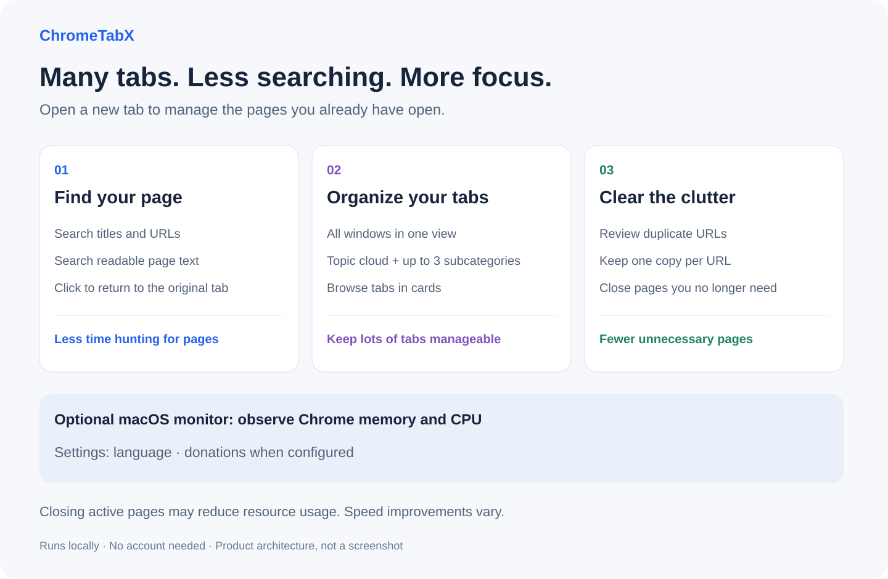
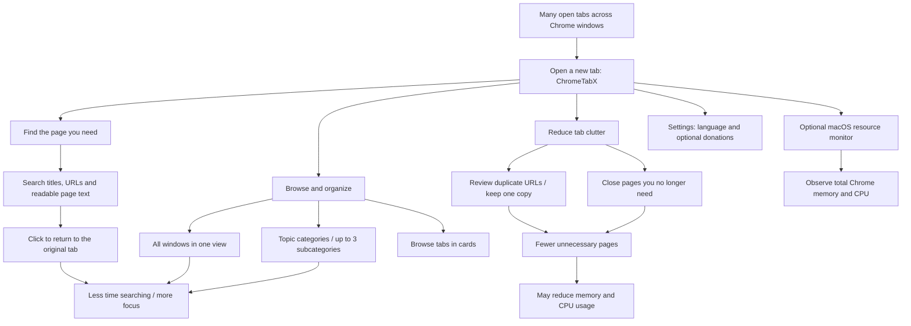

# ChromeTabX

**Manage more tabs with less effort. Find pages faster. Give your computer room to breathe.**

**English** · [简体中文](README.zh-CN.md)

ChromeTabX is a **Chrome extension that turns your new-tab page into a searchable list of your open tabs**. Instead of clicking through tiny tabs, open a new tab, type a word you remember, and jump straight to the page.



*Current product architecture: find pages, organize tabs, and reduce clutter. Not an application screenshot.*

## More tabs, less time lost

Keep the pages you need without losing track of them. ChromeTabX brings scattered tabs into one searchable view so you can spend less time hunting for a page and get back to your work.

Closing unneeded pages—especially those running video or scripts—can reduce Chrome’s memory and CPU usage and help your computer stay responsive. The benefit depends on the pages you close; fewer tabs do not guarantee a speed increase. The optional macOS monitor lets you observe Chrome’s actual resource usage.

## How everything fits together



*This is a map of the current product. Resource savings vary; the extension does not automatically close tabs or promise a fixed speed improvement.*

## Does this sound familiar?

| When you… | ChromeTabX helps you… |
| --- | --- |
| Know you opened a page, but cannot find it | Search its title, URL, or readable page text. |
| Have work, research, and reading scattered across tabs | Browse automatically generated topic categories. |
| Keep opening the same link again | Review duplicate URLs and close the extra copies. |
| Have several Chrome windows open | See tabs from every window in one place. |

**Try it:** open a new tab → search for “project” → click the page you were looking for.

Your pages stay in Chrome. No account or cloud service is needed.

**[Download & install](#install)** · [中文介绍](README.zh-CN.md) · [Report a problem](https://github.com/anzai3/ChromeTabX/issues)

## Features

- **All windows in one place.** Every new-tab page shows tabs from all managed windows, with no window selector.
- **Search beyond titles.** Match titles, URLs, and readable text in loaded pages. Content matches include a short excerpt. Press `/` to focus search.
- **Automatic category cloud.** Shared title keywords become categories. Larger groups can show up to three secondary categories, with consistent colors for browsing.
- **Keep one copy of a URL.** Preview duplicate tabs before confirming cleanup across windows.
- **Simple tab controls.** Open, preview, or close tabs in a card view.
- **English and Simplified Chinese.** Follow Chrome's UI language by default, or switch instantly without losing search and filters.
- **Optional Chrome metrics on macOS.** A local helper displays total Chrome memory and CPU usage.

## Install

Requires **Chrome 121 or later**. The extension is installed from source; the optional resource monitor requires macOS and Python 3.

1. [Download the source ZIP](https://github.com/anzai3/ChromeTabX/archive/refs/heads/main.zip) and extract it, or clone the repository:
   ```sh
   git clone https://github.com/anzai3/ChromeTabX.git
   ```
2. Open `chrome://extensions` in Chrome and enable **Developer mode**.
3. Select **Load unpacked** and choose the folder containing `manifest.json`.
4. Open a new tab. If Chrome asks whether to keep the new-tab replacement, confirm it.

After updating the source, click **Reload** on the extension card and open a new tab. If you cloned the repository, use `git pull --ff-only` to download updates.

## Page summaries and preview

Cards show a one-line page description or opening text. Hover over the **Preview button** to temporarily load the webpage in a floating frame; move away to destroy it. Hovering elsewhere on a card does nothing. Preview content defaults to 80% scale, adjustable from 70% to 100%. Use **Text preview** or **Open original tab** when a site refuses embedding. Click **Preview** for the existing text preview dialog. Only cards near the viewport are read, with two concurrent reads and a short in-memory cache. The preview can open the original tab on request.

Card summaries and the click dialog use text excerpts, not AI-written summaries. The hover frame separately requests the webpage and may run its scripts or use its login cookies; it is not a mirror of the original tab. Sites may block embedding or require sign-in. The frame is sandboxed without forms, popups, downloads or top-level navigation; use **Open original tab** if it cannot display. Restricted, empty or discarded pages may be unavailable. The extension does not wake discarded tabs or send page content to a server.

## Everyday use

Type in the search box to find a page, select a category to narrow the results, and click a page title to switch to that tab and its window. Tabs from all managed windows are shown together.

Use **Remove duplicates** to review matching URLs before closing extras. Cleanup covers all windows, even when the visible results are filtered. Save unfinished forms before confirming a close.

Click the **⚙ Settings** button at the bottom of the sidebar to open the settings dialog to access the language selector. It offers **System**, **简体中文**, and **English**. Unsupported languages fall back to English. Your selection stays on this device. Page titles, excerpts, and extracted category keywords remain in their original language.

## How it works

### Duplicate cleanup

Only identical, complete HTTP/HTTPS URLs are grouped. Protocols, query strings, and fragments remain significant. Different URLs are never merged merely because their titles or content look similar. Private and normal browsing contexts are kept separate.

For each group, the extension prefers a pinned tab, then an active tab, then the most recently accessed tab. Candidates are checked again when cleanup is confirmed. There is no automatic background closing.

### Page-content search

Search starts after a 300 ms pause and reads at most four pages concurrently. It matches continuous text, with case-insensitive English matching. Use **Search content again** after a page changes.

Search reads loaded, visible text in the main frame. Protected browser pages, restricted sites, and discarded tabs may be unavailable; their titles and URLs can still match. The extension does not wake discarded tabs. Iframes, PDF viewers, image text, unloaded content, and closed Shadow DOM are outside the search scope.

### Title-based categories

Local word segmentation extracts shared keywords and filters common filler words, numeric fragments, and known site suffixes. At least two tabs must share a keyword to form a primary category; remaining tabs appear under Other. Each tab has one primary category.

Groups with at least six tabs can expose up to three secondary categories based on additional shared keywords. Secondary categories can overlap, so their counts should not be added together. Category membership is computed from all managed tabs. Sidebar counts and displayed cards both respect the search query across all windows; categories outside that scope show zero. This is keyword grouping, not AI semantic classification.

### Last-access information

Last-access labels use Chrome's `lastAccessed` timestamp, not publication dates or visit frequency. Unknown timestamps are not estimated. The code retains inactivity-filtering logic, but the simplified interface currently has no dedicated inactive-tabs navigation entry.

## Optional macOS memory and CPU monitor

Tab management works without the helper. To enable metrics:

1. Copy the extension ID from `chrome://extensions`.
2. Run from the repository folder, replacing `YOUR_EXTENSION_ID`:
   ```sh
   python3 native/install.py YOUR_EXTENSION_ID
   ```
3. Reload the extension and open a new tab.

The helper uses Native Messaging and permits only the extension ID supplied during installation. It reads local Chrome process statistics; it does not accept arbitrary commands or upload measurements.

- **Memory:** total resident memory (RSS) across Google Chrome processes. Shared pages may be counted more than once.
- **CPU:** approximately one second of sampled process CPU time. 100% represents one fully occupied core; multiple cores can exceed 100%.
- **Scope:** all local Google Chrome windows, profiles, and helper processes.
- **Refresh:** on each new-tab page load, on manual refresh, and every five minutes while the page is visible. Returning to a page refreshes it if at least five minutes have elapsed since its last attempt. Other activity and retained caches mean closing a tab does not guarantee either number will fall.

A disconnected monitor shows dashes. Check that the helper was installed with the current extension ID, then reload the extension. Other platforms do not currently have a metrics helper.

To uninstall the helper, remove its files from `~/Library/Application Support/TabMatrixMetrics` and its registration file at `~/Library/Application Support/Google/Chrome/NativeMessagingHosts/com.tabmatrix.metrics.json`.

## Privacy and permissions

The extension itself uses no account, analytics, remote scripts, external fonts, or cloud processing. Hover previews load the selected website directly; that website’s own network requests and policies apply. Search excerpts stay in the new-tab page's memory; they are not persisted or uploaded. Language preferences are stored locally.

| Permission | Purpose |
| --- | --- |
| `tabs` | Read tab titles and URLs; manage tabs across windows. |
| `scripting` | Read page text for search, visible-card summaries, and previews. |
| HTTP/HTTPS host access | Allow page-text reading on permitted websites. |
| `nativeMessaging` | Connect to the optional local metrics helper. |

Incognito access is not enabled by default. The extension's own new-tab pages are excluded from the managed tab list.

## Development

The extension also uses the name **Tab Matrix** in its UI. Built with vanilla JavaScript and Manifest V3, it requires no dependencies or build step to load.

Use a recent Node.js version with its built-in test runner:

```sh
npm test
```

For a browser preview with sample data:

```sh
python3 -m http.server 8765
```

Open `http://localhost:8765/newtab.html`. Preview mode cannot manage real tabs or display live Chrome metrics; load the extension for those features.

| File or directory | Responsibility |
| --- | --- |
| `app.js`, `newtab.html`, `style.css` | Tab manager UI and interaction. |
| `core.js`, `title-rules.js` | Duplicate detection, access labels, title categories. |
| `content-search.js` | On-demand page-content search. |
| `background.js` | Extension action handling. |
| `metrics.js`, `native/` | Resource display and optional macOS helper. |
| `packages/app-i18n/` | Reusable language runtime and DOM adapter. |
| `tests/` | Behavior and regression tests. |

The [i18n package guide](packages/app-i18n/README.md) covers its API and integration. It is a local, versioned package, not a published npm dependency. The extension currently keeps a separate compatibility layer for older UI strings.

## Donation entry module

The reusable [app-support module](packages/app-support/README.md) provides an optional donation entry under Settings. Set the owner’s verified HTTPS donation URL or crypto receiving details (asset, network, address, optional memo/tag) in `support-config.js` to enable it. Crypto addresses have a copy button; no wallet connection is requested. No destination is configured yet, so the entry stays hidden. It includes English/Chinese acknowledgements and does not process or track payments.

## Contributing

Bug reports and focused pull requests are welcome. Include reproduction steps, Chrome/OS versions, and expected behavior. Use sample titles and URLs when sharing examples; avoid posting private browsing data.

Run `npm test` for behavior changes. Keep the [English](README.md) and [Chinese](README.zh-CN.md) introductions aligned when changing features or installation instructions.

## License

[MIT](LICENSE). You may use, modify, and distribute the code under the license terms.

Generic tab titles such as “Docs” are checked against the loaded page’s title, document heading, and title metadata. Delayed titles are retried every 15 seconds while the manager is visible; recovered titles are retained for the same tab and URL during that manager session. Sleeping tabs are not reloaded.

Card thumbnails are local screenshots of pages you actually visit, captured after a 1.2-second pause. Images are resized to 320×180 WebP, loaded only near the viewport, and cached in memory for up to 30 minutes (100 images maximum). No background tabs are activated; uncached cards remain blank. Incognito, file, and browser pages are excluded. Screenshot capture requires `<all_urls>` and session caching uses `storage`; reload the extension after updating.
