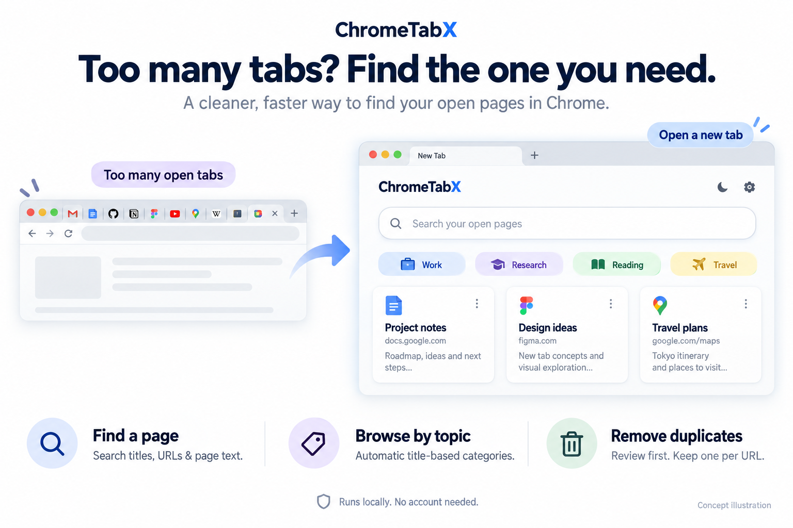

# ChromeTabX

**标签开了一大堆？快速找到要看的页面，顺手关掉重复的。**

[English](README.md) · **简体中文**

ChromeTabX 是一个 **Chrome 扩展：把新标签页变成“已打开网页”的搜索和管理页面**。不用挨个点击顶部挤在一起的小标签，打开一个新标签页，输入记得的词，就能找到原来的网页。



*功能示意图，并非扩展实际截图。图中三个核心操作分别是：找页面、按主题浏览、清理重复页。*

## 你是不是也遇到过？

| 遇到的问题 | 用 ChromeTabX 怎么解决 |
| --- | --- |
| 明明打开过一个网页，却怎么也找不到 | 搜索标题、网址，或者网页里记得的一句话。 |
| 工作、资料、阅读页面混在一起 | 点击根据标题自动生成的主题分类。 |
| 同一个链接不知不觉开了好几遍 | 先查看重复页面，再清理多余的副本。 |
| 开了好几个 Chrome 窗口 | 默认看当前窗口，需要时切换到所有窗口。 |

**试一次就明白：** 打开新标签页 → 搜索“项目” → 点击找到的页面，回到原来的标签。

网页仍然留在 Chrome 中。无需注册账号，也不需要云服务。

**[下载与安装](#安装)** · [English](README.md) · [反馈问题](https://github.com/anzai3/ChromeTabX/issues)

## 功能

- **默认查看当前窗口**：新标签页首先显示所在窗口的页面，也可选择其他窗口或所有窗口。
- **搜索网页正文**：搜索标题、网址和已加载页面中的可读文字，正文命中附带片段；按 `/` 聚焦搜索。
- **自动分类云**：从标题的共同关键词生成分类；较大分类最多显示三个二级分类，以固定配色区分。
- **相同网址只留一个**：预览重复页面，确认后跨窗口清理。
- **便捷管理**：打开、关闭、固定或取消固定标签，在卡片与列表之间切换。
- **中英文界面**：默认跟随 Chrome 界面语言，可即时切换，保留搜索和筛选条件。
- **可选的 macOS 资源监控**：通过本机辅助程序显示 Chrome 总内存与 CPU 占用。

## 安装

需要 **Chrome 121 或更新版本**。目前通过源码加载；可选资源监控需要 macOS 和 Python 3。

1. [下载源码 ZIP](https://github.com/anzai3/ChromeTabX/archive/refs/heads/main.zip) 并解压，或克隆仓库：
   ```sh
   git clone https://github.com/anzai3/ChromeTabX.git
   ```
2. 在 Chrome 打开 `chrome://extensions`，开启**开发者模式**。
3. 点击**加载已解压的扩展程序**，选择包含 `manifest.json` 的目录。
4. 新建标签页；如 Chrome 询问是否保留新标签页替换，选择保留。

更新源码后，在扩展页面点击**重新加载**，再打开新标签页。通过 Git 克隆的用户可运行 `git pull --ff-only` 获取更新。

## 日常使用

输入关键词寻找页面，点击分类缩小范围，点击页面标题切换至对应标签及窗口。窗口筛选默认选择当前窗口，需要时可切换到**所有窗口**。

点击**清理重复标签**，先检查候选页面，再确认关闭。清理覆盖所有窗口，即使当前列表经过筛选也是如此。关闭前请保存尚未提交的表单内容。

点击侧栏的**设置**展开语言选项，提供**跟随系统**、**简体中文**和 **English**。不支持的语言回退英文；选择保存在当前设备。网页标题、正文片段及分类关键词保持原文。

## 工作方式

### 重复标签清理

只合并完整 URL 相同的 HTTP/HTTPS 页面。协议、查询参数和片段不同会视为不同地址，不会仅因标题或正文相似就合并。无痕与普通浏览环境分别处理。

每组优先保留固定标签，其次为窗口活动标签，再次为最近访问的标签。确认时重新检查候选页面。不会自动在后台关闭标签。

### 网页正文搜索

停止输入 300 毫秒后开始搜索，最多同时读取四个页面。支持连续文本匹配，英文不区分大小写。页面内容变化后可点击**重新搜索正文**。

搜索范围为主页面当前已加载的可见文字。受保护的浏览器页面、权限受限站点和已休眠丢弃的标签可能无法读取，仍可匹配其标题和网址。不会自动唤醒休眠标签。iframe、PDF 阅读器、图片文字、未加载内容及封闭 Shadow DOM 不在正文搜索范围内。

### 标题自动分类

在本机分词，从标题中提取共同关键词，过滤常见虚词、数字片段及已知站点后缀。至少两个标签共享关键词才生成一级分类，剩余标签归入“其他”。每个标签只属于一个一级分类。

一级分类达到六个标签时，可根据额外共同关键词生成最多三个二级分类。二级分类可能重叠，数量不可直接相加。分类基于所有受管理标签计算，窗口筛选决定实际显示的结果。这是关键词分组，不是 AI 语义分类。

### 最近访问信息

访问时间来自 Chrome 的 `lastAccessed`，不是网页发布日期或访问频次；未知时间不进行推算。代码保留久未访问筛选逻辑，但当前简化界面没有独立的久未访问导航入口。

## 可选的 macOS 内存与 CPU 监控

不安装辅助程序也能正常管理标签。启用监控：

1. 从 `chrome://extensions` 复制扩展 ID。
2. 在仓库目录运行以下命令，将 `YOUR_EXTENSION_ID` 替换为实际 ID：
   ```sh
   python3 native/install.py YOUR_EXTENSION_ID
   ```
3. 重新加载扩展并打开新标签页。

辅助程序使用 Native Messaging，仅允许安装时指定的扩展 ID 连接。它读取本机 Chrome 进程统计，不接受任意命令，也不上传数据。

- **内存**：所有 Google Chrome 进程的常驻内存 RSS 合计，共享内存可能重复计算。
- **CPU**：约一秒采样期间的进程 CPU 时间；100% 表示一个核心被占满，多核可以超过 100%。
- **范围**：本机所有 Google Chrome 窗口、用户配置及辅助进程，不限于当前筛选窗口。
- **刷新**：每十秒及关闭标签后更新。其他页面活动和缓存保留会影响数据，关闭标签不保证数值下降。

未连接时显示破折号。请检查安装使用的扩展 ID 是否正确，再重新加载扩展。目前其他操作系统没有对应采集程序。

卸载辅助程序时，删除 `~/Library/Application Support/TabMatrixMetrics` 中的本功能文件，以及注册文件 `~/Library/Application Support/Google/Chrome/NativeMessagingHosts/com.tabmatrix.metrics.json`。

## 隐私与权限

无需账号，不使用分析统计、远程脚本、外部字体或云端处理。搜索片段只留在当前新标签页内存，不持久化、不上传；语言偏好保存在本机。

| 权限 | 用途 |
| --- | --- |
| `tabs` | 读取标题与网址，跨窗口管理标签。 |
| `scripting` | 按需搜索可读取的网页文字。 |
| HTTP/HTTPS 网站访问 | 在获得许可的网站中进行正文搜索。 |
| `nativeMessaging` | 连接可选的本机资源采集程序。 |

默认不启用无痕访问。扩展自身的新标签页不计入管理列表。

## 开发

扩展界面也使用 **Tab Matrix · 标签矩阵** 名称。基于原生 JavaScript 和 Manifest V3，加载扩展无需安装依赖或构建。

使用支持内置测试运行器的较新 Node.js：

```sh
npm test
```

使用示例数据预览界面：

```sh
python3 -m http.server 8765
```

打开 `http://localhost:8765/newtab.html`。预览模式无法管理真实标签或显示 Chrome 实时资源数据；这些能力需要加载扩展。

| 文件或目录 | 职责 |
| --- | --- |
| `app.js`、`newtab.html`、`style.css` | 标签管理界面与交互。 |
| `core.js`、`title-rules.js` | 去重、访问时间、标题分类。 |
| `content-search.js` | 按需正文搜索。 |
| `background.js` | 扩展按钮操作。 |
| `metrics.js`、`native/` | 资源展示及可选 macOS 采集程序。 |
| `packages/app-i18n/` | 可复用语言运行时与 DOM 适配器。 |
| `tests/` | 行为与回归测试。 |

[多语言模块指南](packages/app-i18n/README.md) 包含接口和接入方式。它是本地版本化模块，尚未发布到 npm。扩展目前为旧界面文案保留了单独兼容层。

## 捐款入口模块

可复用的 [app-support 模块](packages/app-support/README.md) 在设置中提供可选捐款入口。在 `support-config.js` 填入所有者核验的 HTTPS 收款链接后启用。目前尚未配置，入口保持隐藏。模块包含中英文感谢文案，不处理或追踪支付。

## 参与贡献

欢迎提交问题和范围明确的 Pull Request。请提供复现步骤、Chrome 与操作系统版本，以及预期行为。示例使用虚构标题和网址，避免提交个人浏览数据。

功能改动后运行 `npm test`。修改功能或安装方式时，请同步维护[英文](README.md)与[中文](README.zh-CN.md)介绍。

## 许可证

采用 [MIT License](LICENSE)，可按许可条款使用、修改和分发。
